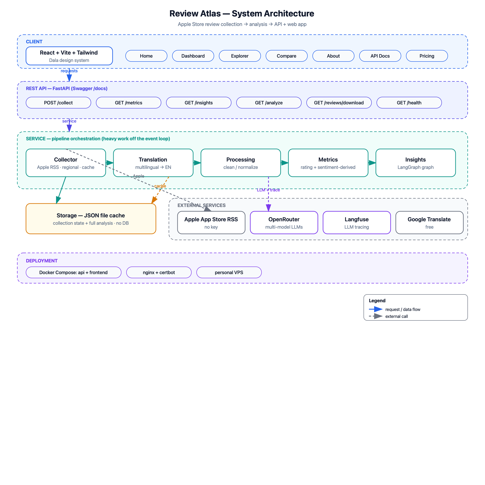
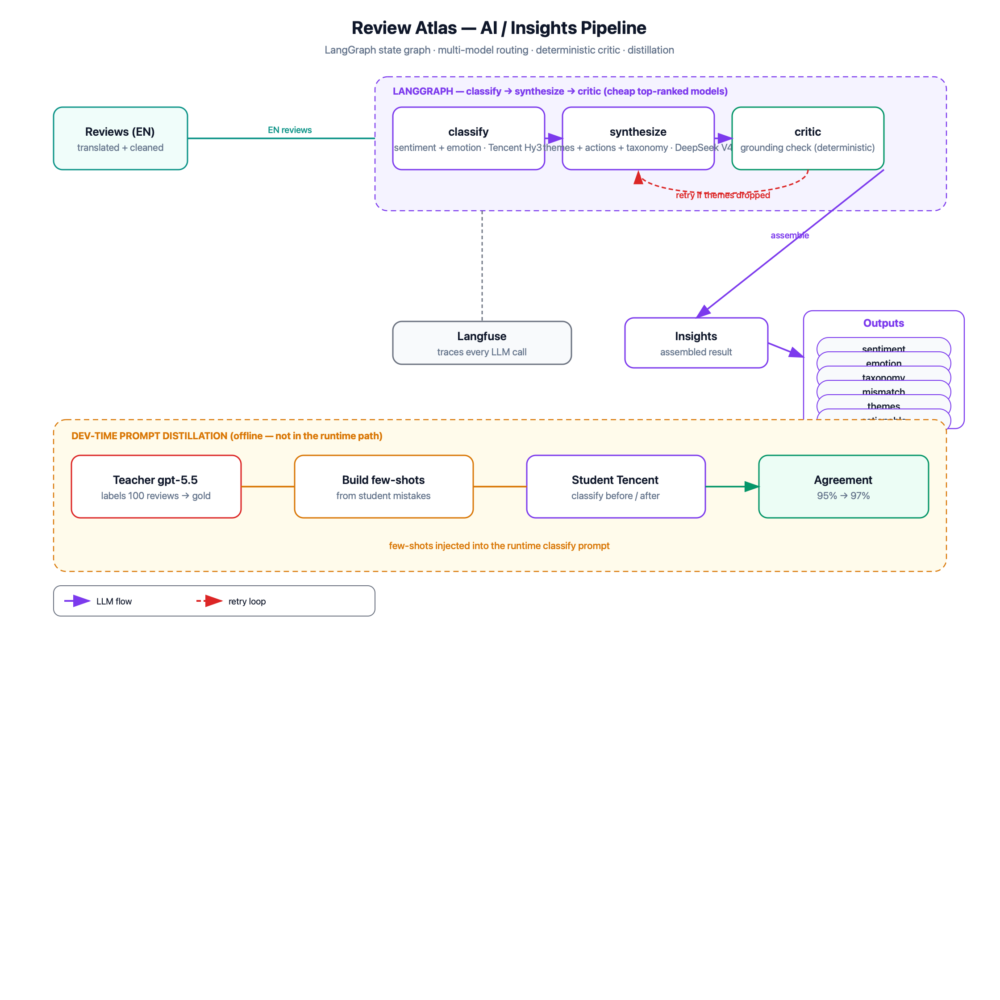

<p align="center">
  
</p>

<h1 align="center">Review Atlas — Apple Store Review Analysis</h1>

<p align="center">
  Collect Apple App Store reviews for any app, process them, and turn them into metrics
  and AI-generated insights — exposed through a REST API and a web dashboard.
</p>

<p align="center">
  <b>Live demo:</b> <a href="https://obrio.teriffic.xyz">obrio.teriffic.xyz</a> ·
  Built as a technical assignment for <b>OBRIO</b> (Genesis)
</p>

> The comparative report (**Nebula vs Co-Star**) is the live **Compare** page; pick any app
> by name on the home page to run a fresh analysis. The demo is access-gated — the token is
> shared with reviewers separately.

## What it does

- **Collects** ~100 reviews for any App Store app from Apple's **public reviews RSS**
  (no API key, no third-party service).
- **Translates** non-English reviews to English (best-effort) so the explorer is uniform;
  the multilingual LLM analyzes the **original** text.
- **Computes metrics** — average rating, star distribution, top/bottom-box, rating by app
  version, an adaptive rating-over-time trend, plus sentiment-derived metrics (emotion
  breakdown, bug/feature/UX/pricing taxonomy, star↔sentiment mismatch).
- **Generates insights** with an LLM pipeline — sentiment, common themes in negative
  reviews (with example quotes), and concrete, actionable recommendations.
- **Serves everything** via a documented REST API with raw-data download (JSON / CSV), and
  a dark, cosmic web dashboard (the **Dala** design system) with a name-search, a 3D
  particle loading scene, and a side-by-side Compare page.

## Architecture



## Highlights

- **Robust collection.** Apple's RSS is intermittently empty per storefront, so collection
  is **region-based** (europe / asia / africa) and falls through storefronts until it has
  enough — with an **incremental top-up cache** that only ever fetches the deficit.
- **Real AI, measured & fast.** Insights run through a **LangGraph** state graph
  (classify → synthesize → a deterministic critic that drops hallucinated themes, with a
  re-synthesize loop) on cheap, **top-ranked, non-reasoning** OpenRouter models from
  different vendors. Classify batches run **concurrently** and every call is timeout-bounded,
  so a full analysis lands in ~20-30s.
- **Prompt distillation.** A premium teacher (`gpt-5.5`) is used at dev-time to distill
  few-shot examples for the cheap runtime model — agreement measured **before 93% → after 94%**.
- **Observability.** Every LLM call is traced to **Langfuse** when keys are set.

## Tech stack

**Backend:** Python 3.12 · FastAPI · LangGraph · Langfuse · OpenRouter · httpx · Pydantic ·
uv · pytest · Docker.
**Frontend:** React · Vite · Three.js (particle visuals) · hand-rolled SVG charts · a small
inline-style system (the **Dala** design tokens) — no CSS framework.
**Deploy:** Docker Compose + host nginx + certbot (a plain VPS, no Traefik/PaaS).

## Quick start (local)

Requirements: Python 3.12, [uv](https://docs.astral.sh/uv/), and an OpenRouter API key.

```bash
cd backend
cp .env.example .env            # add OPENROUTER_API_KEY (+ optional OPENAI_API_KEY, LANGFUSE_*)
uv sync
uv run uvicorn app.main:app --port 8100 --reload
```

Open the interactive docs at **http://localhost:8100/docs**, then try:

```bash
curl "http://localhost:8100/analyze?app_id=1459969523&region=europe&limit=100"
```

(`1459969523` is Nebula.) For the web app: `cd frontend && npm install && npm run dev`
(it proxies `/api` to the backend). See **[docs/api-reference.md](docs/api-reference.md)**
for the full API.

## API

| Method | Path | Description |
|--------|------|-------------|
| `POST` | `/collect` | Collect reviews, return metadata |
| `GET` | `/metrics` | Rating metrics (no LLM) |
| `GET` | `/insights` | Sentiment, emotions, themes, taxonomy, recommendations |
| `GET` | `/analyze` | Full analysis (metrics + insights), cached |
| `GET` | `/reviews` · `/reviews/download` | Enriched reviews; raw download as JSON or CSV |
| `GET` | `/health` · `/auth/verify` | Liveness probe · access-token check |

When `ACCESS_TOKEN` is set, data endpoints require an `X-Access-Token` header.

## How the AI works



The insights pipeline is a small but real **LangGraph** graph:

1. **classify** — sentiment + emotion per review, batched **and run concurrently**
   (`qwen/qwen3-30b-a3b-instruct-2507` — fast, non-reasoning).
2. **synthesize** — negative themes, recommendations, and a taxonomy
   (`google/gemini-2.5-flash-lite`). A distinct vendor from classify keeps the routing
   genuinely multi-model.
3. **critic** — a *deterministic* grounding check that drops any theme not actually present
   in the reviews, looping back to re-synthesize once if needed.

Models are configurable in `backend/app/config.py`. There is no offline fallback — an
`OPENROUTER_API_KEY` is required. Reasoning models were deliberately benchmarked **out** of
the runtime (they burned thousands of hidden tokens per call and caused multi-minute hangs).
Premium-model validation lives only in the dev-time distillation script
(`backend/scripts/distill_prompts.py`), not in the request path.

## Testing

```bash
cd backend && uv run pytest        # 30 tests (collector, metrics, insights graph, API)
```

The LLM tests make **real** OpenRouter calls (and skip cleanly without a key).

## Docker & deployment

```bash
docker compose up -d --build       # api (internal :8100) + web (127.0.0.1:8180)
```

The live instance runs this stack behind host nginx + a Let's Encrypt certificate, alongside
other apps on the box. Full VPS deployment is documented in **[DEPLOY.md](DEPLOY.md)**.

## Project structure

```
backend/         FastAPI app, pipeline, LangGraph insights, tests
  app/           collector · translation · processing · metrics · insights/ · service · main
  scripts/       dump_reviews.py · distill_prompts.py
frontend/        Vite/React app (Dala design) + Dockerfile/nginx
  src/           App · AppSearch · Loading/LoadingScene · Particles · Arch/PipelineDiagram · api
scripts/         gen_popular_apps.py  (builds the name-search table from App Store charts)
docs/            api-reference.md · data-collection.md · diagrams/ · plans/ · logo.svg
deploy/          host nginx site (TLS)
```

## Design decisions

- **Apple public RSS** over scraping or the App Store Connect API — no key, works for any app.
- **Region + incremental cache** to survive Apple's per-storefront empty-feed flakiness
  while fetching as little as possible.
- **Cheap, fast, non-reasoning LLMs + distillation** rather than a single premium model —
  inexpensive and quick at runtime, with the quality gap to a premium model measured and closed.
- **No database** — a JSON file cache keeps the deployment dependency-free.
